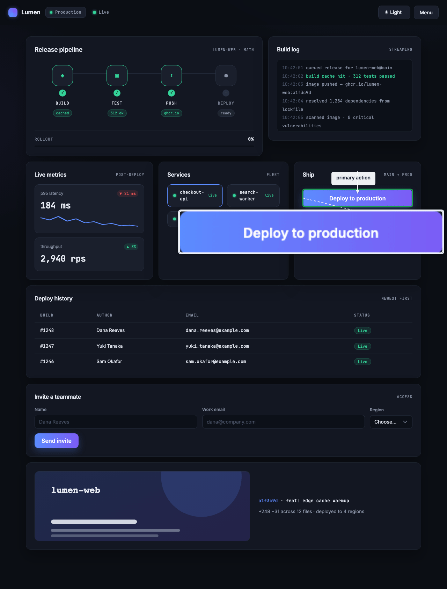
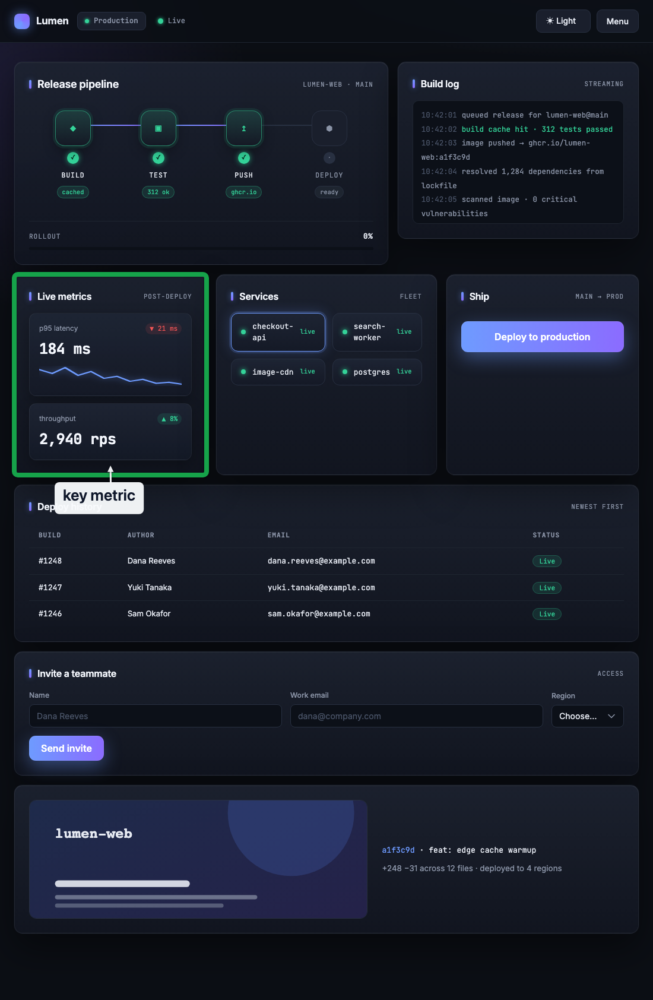
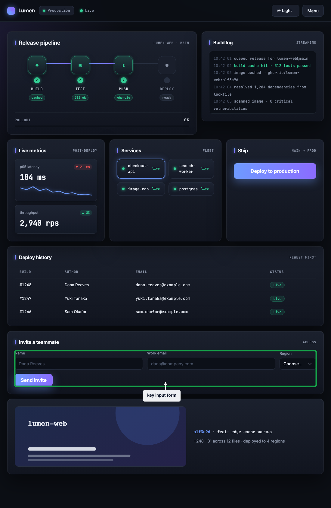
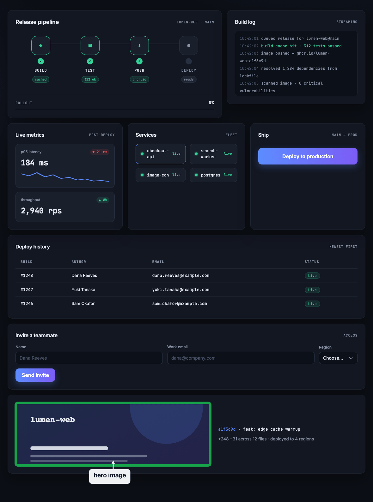
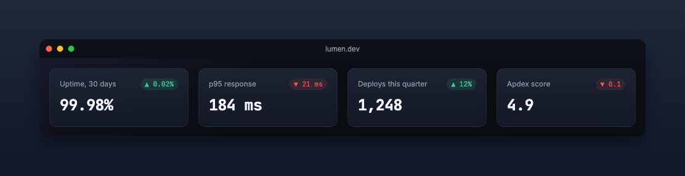

# Showreel

**Transforme uma URL + seletores CSS num visual pronto — screenshots anotados, GIFs de fluxo, gravações de movimento suave e capturas de terminal. Um comando cada. O agente nunca chuta pixel; toda saída é verificada pixel a pixel antes de salvar.**

[](https://github.com/HeyRenan/showreel/actions/workflows/ci.yml)
[](showreel/.claude-plugin/plugin.json)
[](LICENSE)
[](https://claude.com/claude-code)

[English](README.md) · [Português](README.pt-BR.md)

## Showcase

[](assets/showcase.mp4)

*Um take só, cada recurso — drawer, câmera, lupa, spotlight, blur ao vivo, formulário digitado, escolha de região, painel de legenda vivo, deploy de um clique. Gerado inteiramente pelo plugin na página demo embutida. ([clique pra tocar o MP4 completo](assets/showcase.mp4))*

> Toda imagem deste README foi gerada pelo próprio Showreel, na página demo "Lumen" embutida. Rode os mesmos comandos, saem os mesmos arquivos.

## O que é

Plugin de [Claude Code](https://claude.com/claude-code) para **documentação visual** — explicar uma mudança, um bug, o fluxo de uma feature, um showcase de UI/landing ou um passo de tutorial com uma imagem em vez de um parágrafo. Feito pra **informar, não entreter**: para os devs e stakeholders que precisam *entender* como algo funciona, então cada artefato fica legível e proporcional ao conteúdo — sem drama inventado, sem enrolação.

Você aponta pra uma página e nomeia elementos por **seletor CSS**. O Showreel mede o DOM, desenha a anotação exata no alvo, e **valida o resultado antes de sair** — uma captura ruim é erro, nunca um arquivo entregue. Sem loop de screenshot → olhar → tentar de novo, sem coordenada de pixel, sem queimar token chutando.

- **Autossuficiente** — embute o próprio Chromium headless; sem MCP de browser, sem credencial, sem telemetria. A única rede é renderizar a URL que você pedir, mais um download único do Playwright + Chromium no primeiro uso (do npm e da CDN da Microsoft; pré-aqueça com `preflight.sh`).
- **Determinístico** — mesmos seletores entram, mesmos pixels saem. A posição é calculada, não chutada.
- **Barato** — `--batch` renderiza várias capturas num único launch do browser.

## Início rápido

```bash
# instalar
claude plugin marketplace add HeyRenan/showreel
claude plugin install showreel@showreel

# uma vez: checa a máquina + pré-aquece o motor (~90MB de Chromium, uma vez)
bash ~/.claude/plugins/showreel/showreel/scripts/preflight.sh
node ~/.claude/plugins/showreel/showreel/scripts/ensure-deps.mjs
```

Reinicie o Claude Code e invoque **`/showreel`** descrevendo o que capturar. Ou rode um script direto:

```bash
# anota um elemento, autovalidado
node scripts/prove.mjs https://example.com ".cards .card:first-child" out.png --label "Card de serviço verificado"
```

`/showreel:guide` abre um guia visual de setup. Instalação por pasta local e caminhos completos em [INSTALL.md](INSTALL.md).

## Sem configuração — só a URL

Não sabe os seletores? Aponte o Showreel pra uma página e ele acha os elementos salientes sozinho — título, ação principal, navegação, métricas, hero, cards — anota cada um com uma nota por papel e roda o mesmo gate `vcheck` do `prove`. Um único launch.

```bash
node scripts/auto.mjs https://seu-app.exemplo.com
```

| | |
|:---:|:---:|
|  |  |
| **ação principal** — descoberta + com zoom | **métrica-chave** — descoberta |
|  |  |
| **formulário** — descoberto | **imagem hero** — descoberta |

*Os quatro shots saíram de um único comando `auto.mjs` na página-demo embutida — nenhum seletor escrito. Imprime uma linha `PASS` por elemento, depois `AUTO <k>/<n> PASS`, mais um manifesto `index.json`. Um elemento que some antes da captura (re-render de SPA, troca de tema) é um skip suave, nunca uma falha.*

## Frames prontos pra compartilhar

Envolva qualquer captura numa moldura de janela de browser ou card — sombra, cantos arredondados, fundo gradiente — e exporte num aspecto social. Um screenshot cru vira algo pra colar num slide, num README ou num post de lançamento.

```bash
node scripts/beautify.mjs shot.png --url "seu-app.com"          # janela de browser (padrão)
node scripts/beautify.mjs shot.png --ratio 16:9 --frame card    # card social
```



## O que ele faz

Cada recurso, um comando. Todos os scripts ficam em `showreel/scripts/`. O agente sempre fala em **seletor + texto**, nunca em pixel.

| Recurso | Script | O que sai |
|---|---|---|
| **Auto (só URL)** | `auto.mjs` | Descobre os elementos salientes sozinho — título, ação principal, nav, hero, métricas, cards — notas por papel, mesmo gate `vcheck`. Um launch; escreve PNGs + `index.json`. Sem seletores. `--max N`. |
| **Prova anotada** | `prove.mjs` | Retângulo exato no DOM + callout + seta, verificado pixel a pixel (`vcheck`) — sai 0 só no PASS. Flags: `--circle`, `--blur "<sel>"`, `--zoom`, `--batch jobs.json`. |
| **Primitivas de anotação** | `demo.mjs` | Um conceito por imagem: `rect`, `circle`, `arrow`, `badge`, `blur`, `zoom`, `callout`, `label`. `--batch` = 8 capturas num launch só. |
| **Gravação de fluxo** | `rec.mjs` | GIF/MP4 narrado a partir de steps JSON — cursor, ripples, scroll, modais de narração, contador de passos. O GIF do topo é uma chamada só. |
| **Câmera de viewport** | `rec.mjs` | Movimento real de viewport que mantém um fluxo mais longo legível: a página desliza + escala sob um transform animado. `camera` enquadra um elemento, `follow` persegue o cursor, `inset` é uma lupa. |
| **Spotlight / câmera lenta / auto-anotação** | `rec.mjs` | `spotlight` escurece tudo menos o alvo; `speed` por passo deixa uma animação lenta; `--auto-annotate` contorna um `click`/`fill` cru de graça. |
| **Elementos vivos** | `rec.mjs` | Um `glossary`/`modal` com `id` vira **live** — steps `live` seguintes fazem append/update/recolor/replace/remove das linhas no lugar, sem rebuild, sem piscar. Cores por item, texto casado ao tema. |
| **Render offline** | `rec.mjs --offline` | Renderiza no relógio virtual da página — pausas de leitura colapsam, takes com muito texto terminam numa fração do tempo. Melhor para takes estáticos/de texto; rajadas de movimento (`confetti`, `sparkline`) exigem um take em realtime. |
| **Gravação de terminal** | `tape.mjs` | Prova de CLI via [vhs](https://github.com/charmbracelet/vhs): steps JSON → `.tape` → GIF. O GIF do preflight abaixo é uma chamada só. |
| **Comparação before/after** | `compose.mjs`, `lh-ba.sh` | Dois PNGs ou dois GIFs lado a lado com rótulos. `lh-ba.sh` roda Lighthouse real nos dois branches. |
| **Otimizador de tamanho** | `shrink.mjs` | Re-encoda gif/png sem perda visível; `--target-kb` percorre uma escada de qualidade. Toda imagem daqui passou por ele. |
| **Frames prontos pra compartilhar** | `beautify.mjs` | Envolve qualquer PNG numa moldura de janela de browser / card — sombra, cantos arredondados, fundo gradiente, e presets de aspecto social `--ratio 16:9\|9:16\|1:1`. |
| **Corte justo** | `shot.mjs` | Só o elemento, sem anotação. |

### Gravação: como os steps funcionam

`rec.mjs` recebe steps JSON — cada um nomeia um elemento e o que fazer. O script cuida de todo o movimento.

```bash
node scripts/rec.mjs <url> --steps-json '[
 {"click":"#menu","note":"Drawer abre","badge":1,"screen":"Dashboard"},
 {"scrollTo":".cards","rect":true,"glide":true,"note":"Serviços ativos","badge":2},
 {"fill":"#email","text":"dana@example.com"},
 {"camera":{"sel":".kpis","zoom":1.3},"note":"Enquadrando os KPIs"},
 {"click":"#deploy","follow":1.6,"note":"Câmera persegue o cursor"}
]' out.gif
```

**56 chaves de step** (chave desconhecida é rejeitada na entrada):

- **ações** — `click, fill, text, select, option, scrollTo, scrollIn, to, hide`
- **anotação** — `note, arrow, badge, rect, circle, marks, glossary, inset, modal`
- **câmera / movimento** — `camera, zoom, follow, glide, speed`
- **ênfase** — `spotlight, blur, redact, highlight, pulse, ripple, shake, glow, flash`
- **estado / dados** — `checkmark, typeon, reveal, orbit, kenburns, progress, countdown, countup, sparkline, confetti, trail`
- **live** — `live` (muta um `glossary`/`modal` no lugar entre steps — append/update/recolor/replace/remove)
- **chrome / tempo** — `screen, topbar, bottombar, wait, delay, fade, stagger, accent`
- **knobs por efeito** — `size, dur, count, intensity`

**Escreva rápido:** `--dry` resolve cada seletor na página viva em <1s (`[ok]`/`[MISS]` por step, sem gravar) — corrija os misses, grave uma vez. `--pace fast` corta as pausas ~45% pra rascunho. `--contact-sheet` escreve um mosaico de ~24 frames pra o take se revisar sozinho.

### Veja cada um

Cada recurso, demonstrado — toda imagem gerada pelo plugin na página demo.

| | | |
|:---:|:---:|:---:|
|  |  |  |
| **prove** — prova anotada | **camera** — movimento de viewport | **marks** — sub-badges |
|  |  |  |
| **modal** — narração | **bars** — contexto topo/base | **spotlight** — escurece tudo menos o alvo |
|  |  |  |
| **speed** — câmera lenta por passo | **auto-annotate** — contorno de graça | **stamp** — contador de passos |
|  |  |  |
| **fill** — input digitado | **select** — escolha em dropdown | **inset** — lupa |
|  |  |  |
| **glossary** — painel de legendas | **hide** — some com um elemento | **glide** — scroll animado |
|  |  |  |
| **compose** — before/after (movimento) | **tape** — captura de terminal | **compose** — before/after (estático) |

**Elementos vivos & estado** — um painel que cresce no lugar, mais o kit completo de movimento/estado:

| | | |
|:---:|:---:|:---:|
|  |  |  |
| **live** — adiciona linhas no lugar | **confetti** — celebra um sucesso | **countup** — número subindo |
|  |  |  |
| **sparkline** — desenha tendência | **progress** — barra de rollout | **countdown** — contagem pré-ação |
|  |  |  |
| **pulse** — anel de atenção | **ripple** — feedback de toque | **glow** — ênfase ativa |
|  |  |  |
| **checkmark** — etapa concluída | **reveal** — novo conteúdo entra | **flash** — piscada de status |
|  |  |  |
| **orbit** — spinner de trabalho | **trail** — conector A→B | **shake** — bloqueado/erro |
|  |  |  |
| **typeon** — texto em streaming | **kenburns** — zoom lento | **redact** — esconde dado sensível |
|  | | |
| **highlight** — risca de marcador | | |

### Primitivas de anotação (`demo.mjs`)

Oito estilos de callout, um conceito por imagem — as oito de um único launch `demo --batch`:

| | | | |
|:---:|:---:|:---:|:---:|
|  |  |  |  |
| **rect** | **circle** | **arrow** | **badge** |
|  |  |  |  |
| **blur** | **zoom** | **callout** | **label** |

## Por que é rápido

Medido neste código (Apple Silicon, motor quente):

| | Ingênuo | Showreel |
|---|---|---|
| 8 capturas anotadas | 8 launches de browser ≈ 60 s | `demo --batch` ≈ **6 s**, um launch |
| Posição da anotação | ler PNG → chutar pixel → repetir | `autoplace` determinístico, **0 retries** |
| Contraste em página clara/escura | escolher cor na mão | **adaptativo** pela luminância da página |
| Anotações sobrepostas | empurrar na mão | **ciente de colisão**, nunca cobre o alvo |

## Como funciona

O agente manda seletor + texto. O motor (Chromium próprio em `scripts/.deps/`) mede o DOM, posiciona cada anotação de forma determinística (`lib/autoplace.mjs`), e autovalida (`vcheck`) antes de salvar — então não há loop de chute/retry. Capturas web passam pelo Chromium; capturas de terminal pelo `vhs`. O `rec.mjs` é modular: módulos de responsabilidade única (`rec-steps`, `cam-inject`, `rec-camera`, `rec-motion`, `rec-annotate`, `rec-input`, `rec-encode`, `rec-page`) sobre um `clock` que faz de realtime e offline duas implementações do mesmo contrato de tempo.

## Requisitos

node 18+. Opcionais: `ffmpeg` (melhor qualidade de GIF), `vhs` (gravação de terminal). Sem git, sem token, nada pra configurar. `preflight.sh` imprime os comandos exatos de setup pro que faltar. Matriz completa em [INSTALL.md](INSTALL.md), histórico de versão em [CHANGELOG.md](CHANGELOG.md).

## Testes

```bash
cd showreel && node --test 'scripts/__tests__/*.test.mjs'   # sem rede nem browser
```

## Licença

[MIT](LICENSE)
