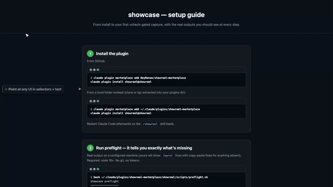
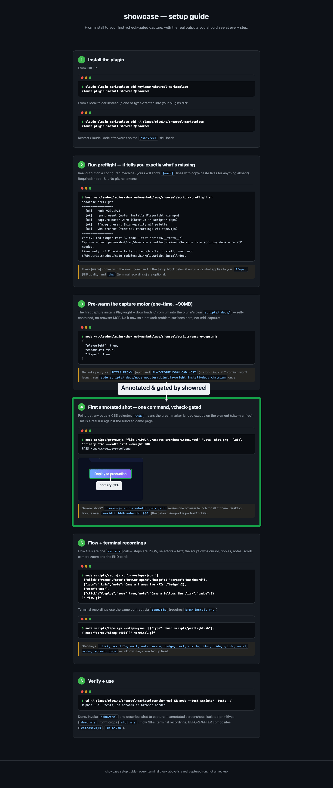
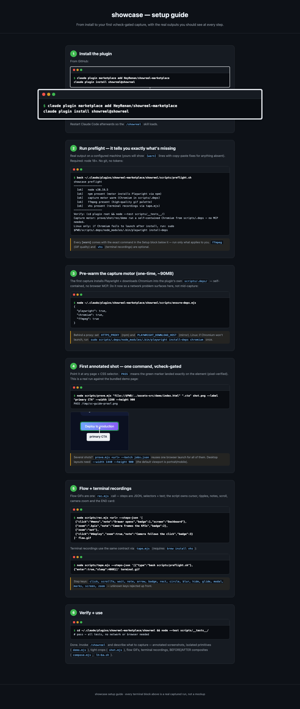
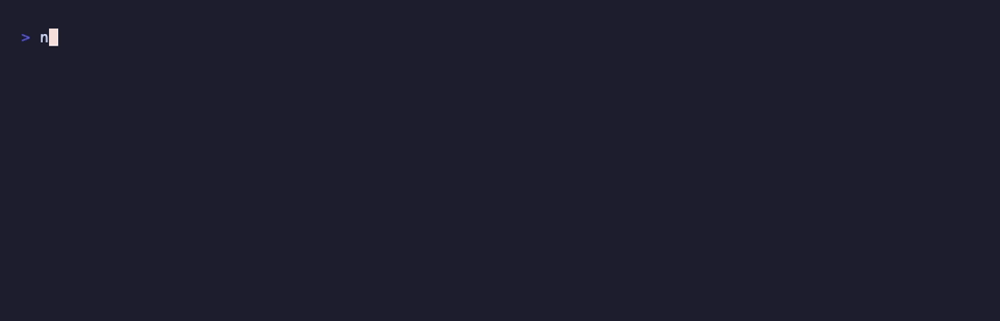
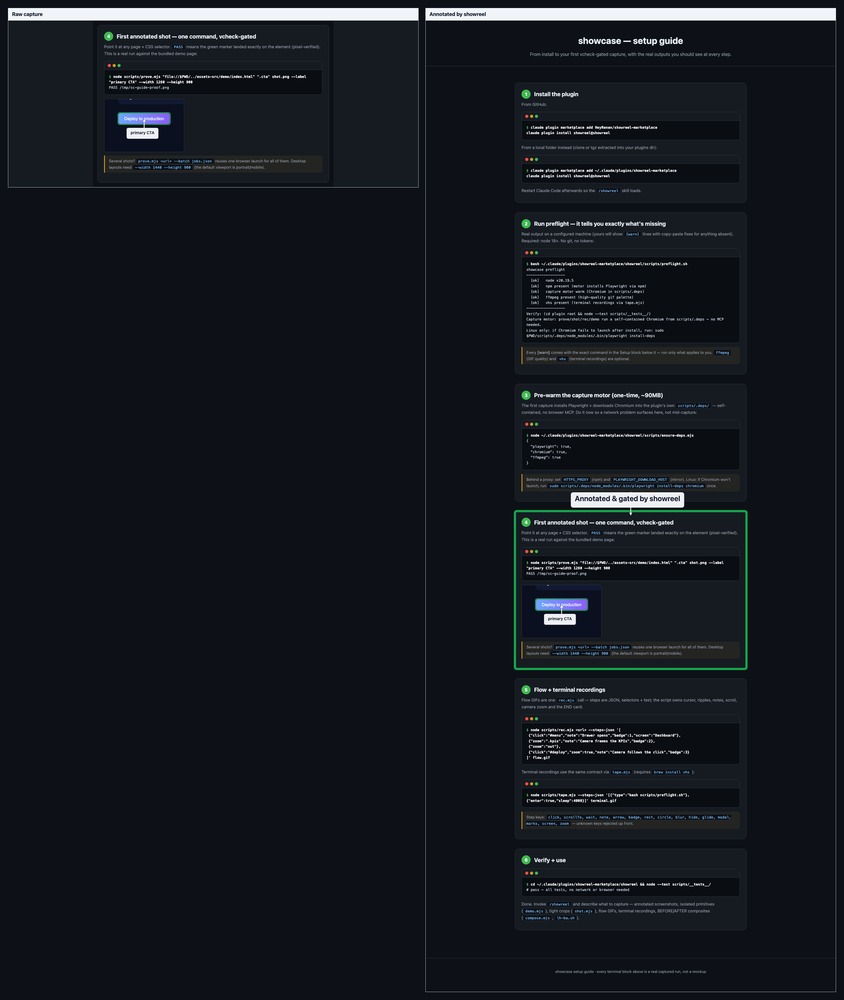

<div align="center">

# 🎬 showreel

### Your UI, on its showreel.

Annotated screenshots · feature demos · flow **GIF/MP4** · terminal recordings · before/after composites
— **one command each, driven by your coding agent.**

Self-contained Chromium motor. Deterministic placement. Self-validated output. **No browser MCP.**

[](.claude-plugin/plugin.json)
[](https://code.claude.com/docs/en/discover-plugins)
[](#how-its-different)
[](#how-its-different)
[](LICENSE)

</div>



> **Every frame above was generated by showreel itself**, documenting its own setup guide — [see the recipe](assets/recipes/hero.json). So is every image below. You speak in CSS selectors and text; the motor measures the DOM, places the marks, draws, and **gates the result** before it ships.

---

## Why showreel

- **You speak in selectors + text — never pixels, never seconds.** The motor owns measurement, placement, timing.
- **Self-validating output gate.** Every artifact is checked for contrast, collision, dominance and target-text-present. It prints `PASS out.png kb=…` or tells you why it failed. Nothing ships unchecked.
- **Runs anywhere Bash runs** — headless, CI, WSL — exactly where a real-Chrome extension can't.
- **Five artifact types, one tool.** Stop stitching CleanShot + Kap + vhs + Percy.
- **Cheap on tokens.** No accessibility-tree dumps, no MCP round-trips.

## Install

```bash
claude plugin marketplace add HeyRenan/showreel-marketplace
claude plugin install showreel@showreel
```

Then warm the motor once (node required; ffmpeg + vhs optional):

```bash
bash ~/.claude/plugins/showreel-marketplace/showreel/scripts/preflight.sh
```

---

## The five pillars

Every image in this section was produced by the command beneath it, against the bundled [`GUIDE.html`](GUIDE.html). Re-run them — they reproduce.

### 1 · Annotated screenshot — self-validated



```bash
node scripts/prove.mjs "<url>" ".step:nth-of-type(4)" annotated.png --label "Annotated & gated by showreel"
# → PASS annotated.png kb=595   (the gate ran; it passed)
```

### 2 · Feature demo still — one primitive, isolated



```bash
node scripts/demo.mjs "<url>" ".step:nth-of-type(1) .term" demo.png --kind zoom
# kinds: rect · circle · arrow · badge · blur · label · zoom · callout
```

### 3 · Flow recording — GIF or cinematic MP4

The hero at the top of this README **is** a flow recording. Cursor glide, per-step notes, camera, all from a step list:

```bash
node scripts/rec.mjs "<url>" --steps assets/recipes/hero.json out.gif --mp4 out.mp4 --fps 30
```

### 4 · Terminal session GIF



```bash
node scripts/tape.mjs --steps assets/recipes/terminal.json terminal.gif
# wraps charmbracelet/vhs — this GIF is showreel running prove.mjs and printing PASS, for real
```

### 5 · Before / after composite



```bash
node scripts/compose.mjs raw.png annotated.png before-after.png --labels "Raw capture,Annotated by showreel"
# also: real Lighthouse before/after across branches via scripts/lh-ba.sh
```

---

## One command per artifact

| Need | Command |
|---|---|
| Annotated screenshot (gated) | `prove.mjs <url> "<sel>" out.png --label "..."` |
| Many shots, one browser | `prove.mjs <url> --batch jobs.json` |
| Clean tight crop of one element | `shot.mjs <url> "<sel>" out.png` |
| One annotation primitive | `demo.mjs <url> "<sel>" out.png --kind <k>` |
| Flow GIF (cursor, notes, camera) | `rec.mjs <url> --steps steps.json out.gif` |
| Cinematic MP4 | `rec.mjs <url> --steps steps.json out.gif --mp4 out.mp4` |
| Terminal session GIF | `tape.mjs --steps steps.json out.gif` |
| Side-by-side composite | `compose.mjs a.png b.png pair.png --labels "Before,After"` |
| Shrink without visible loss | `shrink.mjs in.gif --target-kb N` |

## How it's different

| | showreel | Browser MCP / agent tools | GUI recorders (CleanShot, Kap, Screen Studio) | Visual-regression (Percy, Chromatic) |
|---|---|---|---|---|
| Agent-driven, scriptable | ✅ | ✅ | ❌ | partial |
| Self-validated output gate | ✅ | ❌ | ❌ | pixel-diff only |
| Annotated stills + demos | ✅ | ❌ | manual | ❌ |
| Flow GIF / cinematic MP4 | ✅ | partial | ✅ | ❌ |
| Terminal recordings | ✅ | ❌ | ❌ | ❌ |
| Before/after + real Lighthouse | ✅ | ❌ | ❌ | ❌ |
| Headless / CI / WSL | ✅ | partial | ❌ | ✅ |
| No MCP, no cloud, self-contained | ✅ | ❌ | n/a | ❌ |

The closest thing to showreel is Claude Code's own Chrome integration — but it needs a real Chrome plus an extension, so it can't run headless, in CI, or on WSL, and it doesn't annotate, composite, or record terminals. showreel is built for exactly those gaps.

## The gate, in one line

Other tools ship whatever they captured. showreel **measures** the result and refuses to pass an artifact whose label collides, whose contrast is too low, whose marker doesn't dominate, or whose target text is missing — so the output is correct by construction, not by luck.

---

<div align="center">

Built for [Claude Code](https://code.claude.com). Read the full [setup guide](GUIDE.html).

</div>
